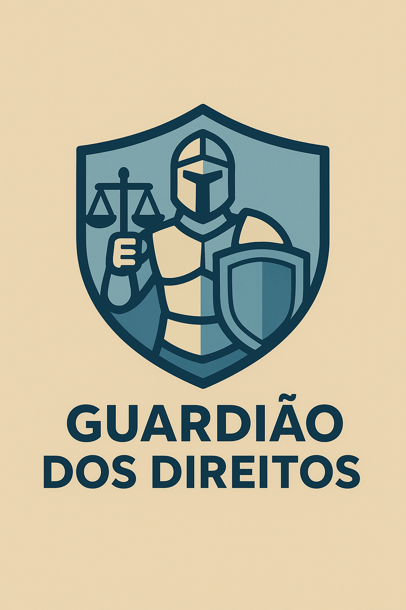
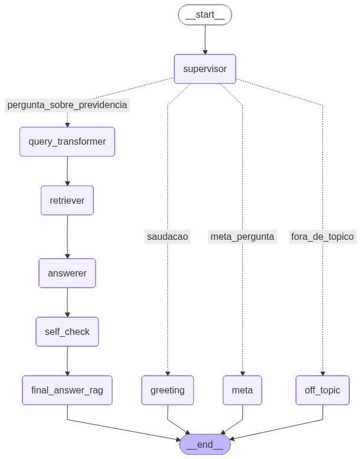

# Guardião dos Direitos ⚖️

[](https://python.org)
[](https://langchain.com)
[](https://opensource.org/licenses/MIT)
[](https://streamlit.io)

<div align="center">
  
</div>

---

**Seu assistente de IA especializado em Direito Previdenciário, construído com uma arquitetura de agentes avançada.**

O Guardião dos Direitos não é apenas mais um chatbot. É um sistema de **Geração Aumentada por Recuperação (RAG)** altamente sofisticado, projetado para responder a perguntas complexas sobre Direito Previdenciário com base em fontes documentais (leis, normas, cartilhas, etc.). O objetivo é fornecer respostas precisas, confiáveis e sempre com **citações diretas**, democratizando o acesso à informação jurídica.

---

## ✨ Principais Funcionalidades

-   **🧠 Roteamento Inteligente com Agente Supervisor**: O sistema primeiro analisa a intenção do usuário. Perguntas sobre o tema são enviadas ao pipeline de RAG, enquanto saudações, meta-perguntas ou tópicos não relacionados são tratados por agentes especializados, tornando a interação mais natural e eficiente.
-   **🎯 Recuperação de Alta Precisão (Retrieval de 2 Estágios)**: Para garantir que as respostas sejam baseadas nos trechos mais relevantes, utilizamos uma abordagem de duas fases:
    1.  **Busca Rápida (FAISS)**: Uma busca vetorial inicial recupera um conjunto amplo de documentos candidatos.
    2.  **Reordenação Fina (Cross-Encoder)**: Um modelo de `Cross-Encoder` (`BAAI/bge-reranker-base`) reavalia esses candidatos, comparando a pergunta diretamente com o conteúdo de cada trecho para promover as respostas mais diretas e contextualmente corretas ao topo.
-   **🔒 Respostas Confiáveis com Citações**: Nenhuma informação é fornecida sem sua devida fonte. Todas as respostas geradas pelo pipeline principal incluem citações obrigatórias, indicando o documento e a página de origem.
-   **🌐 Interface Interativa e Transparente**: Uma interface construída com Streamlit que mostra o status do processamento em tempo real e permite ao usuário visualizar as fontes completas utilizadas para formular cada resposta.

---

## 🚀 Arquitetura e Tecnologias

O coração do Guardião é um grafo computacional gerenciado pelo **LangGraph**, que orquestra a colaboração entre diferentes agentes especializados.

<div align="center">
  
</div>


**Fluxo de Agentes Detalhado:**

1.  **Agente Supervisor**: Atua como o roteador principal. Ele analisa a pergunta e a classifica em uma das categorias: `pergunta_sobre_previdencia`, `saudacao`, `meta_pergunta` ou `fora_de_topico`.
2.  **Execução Condicional**:
    -   Se for uma **saudação** ou **meta-pergunta**, agentes específicos fornecem respostas diretas e amigáveis.
    -   Se for **fora de tópico**, um agente recusa educadamente a solicitação.
    -   Se for sobre **Direito Previdenciário**, a pergunta entra no pipeline RAG principal.
3.  **Pipeline RAG**:
    -   **Query Transformer**: Expande a pergunta original em múltiplas variantes para uma busca mais abrangente.
    -   **Retriever & Reranker**: Busca os documentos mais relevantes usando FAISS e os reordena com um Cross-Encoder para máxima precisão.
    -   **Answerer**: O LLM (Gemini) gera uma resposta com base nos documentos reordenados, incluindo citações.
    -   **Self-Check & Safety**: Agentes finais verificam a presença de fontes e adicionam um aviso legal antes de entregar a resposta final.

**Pipeline de Recuperação Avançada:**
`Consulta` → `Busca Vetorial (FAISS)` → `Top 20 Candidatos` → `Cross-Encoder Reranker` → `Top 5 Mais Relevantes` → `LLM (Gemini)`

| Componente              | Tecnologia/Modelo Utilizado                            | Propósito                                                                      |
| ----------------------- | ------------------------------------------------------ | ------------------------------------------------------------------------------ |
| **Orquestração** | `LangChain` + `LangGraph`                              | Gerencia o fluxo de trabalho condicional entre os agentes.                     |
| **LLM** | `Google Gemini (gemini-2.5-flash)`                     | Geração de texto, reescrita de perguntas e classificação de intenção.          |
| **Embeddings** | `thenlper/gte-small`                                   | Cria representações vetoriais dos trechos de texto para busca semântica.       |
| **Vector Store** | `FAISS (Facebook AI Similarity Search)`                | Armazena os vetores e realiza a busca por similaridade de forma eficiente.     |
| **Reranker** | `BAAI/bge-reranker-base` (Cross-Encoder)               | Reordena os resultados da busca inicial para máxima precisão.                  |
| **Interface (UI)** | `Streamlit`                                            | Cria a interface web interativa para o usuário.                                |
| **Containerização** | `Docker`                                               | Garante a reprodutibilidade e facilita o deploy do ambiente.                   |

---

## ⚙️ Como Executar o Projeto

Siga os passos abaixo para configurar e rodar o Guardião dos Direitos em seu ambiente.

### **Pré-requisitos**

-   Python 3.10+
-   Docker e Docker Compose (para a execução com container)
-   Uma chave de API do Google AI Studio (para o Gemini)

### **1. Configuração Inicial**

1.  **Clone o repositório:**
    ```bash
    git clone https://github.com/paulonc/guardiao-dos-direitos.git
    cd guardiao-dos-direitos
    ```

2.  **Crie o arquivo de ambiente:**
    Copie o arquivo `.env.example` para `.env` e adicione sua chave de API do Google.
    ```bash
    cp .env.example .env
    # Agora edite o arquivo .env e insira sua chave
    # GOOGLE_API_KEY="sua_chave_aqui"
    ```

3.  **Adicione os Documentos:**
    Coloque os arquivos PDF que você deseja indexar dentro da pasta `data/source_docs/`.

### **2. Execução (Duas Opções)**

#### **Opção A: Ambiente Local (Recomendado para Desenvolvimento)**

1.  **Crie o ambiente virtual e instale as dependências:**
    O comando `setup` fará isso por você.
    ```bash
    make setup
    ```

2.  **Ative o ambiente virtual:**
    ```bash
    source .venv/bin/activate
    ```

3.  **Ingestão de Dados:**
    Este comando irá processar seus PDFs e criar o índice vetorial no FAISS. Execute-o sempre que adicionar novos documentos.
    ```bash
    make ingest
    ```

4.  **Inicie a Aplicação:**
    ```bash
    make run
    ```
    Acesse a interface em `http://localhost:8501`.

#### **Opção B: Usando Docker (Recomendado para Produção)**

1.  **Ingestão de Dados (Passo Local Obrigatório):**
    O índice vetorial é criado localmente na pasta `data/vector_store`. Primeiro, execute a ingestão no seu ambiente local (siga os passos 1, 2 e 3 da Opção A).
    ```bash
    make ingest
    ```

2.  **Construa a Imagem Docker:**
    ```bash
    make build
    ```

3.  **Execute o Container:**
    Este comando irá iniciar o container, mapeando a porta e o diretório do projeto.
    ```bash
    make run-docker
    ```
    Acesse a interface em `http://localhost:8501`.

---

## 📜 Comandos do Makefile

Um `Makefile` foi configurado para simplificar as tarefas comuns.

| Comando         | Descrição                                                                           |
| --------------- | ----------------------------------------------------------------------------------- |
| `make setup`    | Cria um ambiente virtual `.venv` e instala todas as dependências do `requirements.txt`. |
| `make install`  | Apenas instala as dependências no ambiente Python ativo.                            |
| `make ingest`   | Executa o script de ingestão para processar os documentos e criar o índice FAISS.   |
| `make run`      | Inicia a aplicação Streamlit no ambiente local.                                     |
| `make build`    | Constrói a imagem Docker para a aplicação.                                          |
| `make run-docker` | Executa a aplicação dentro de um container Docker.                                |
| `make stop`     | Para o container Docker em execução.                                                |
| `make logs`     | Exibe os logs do container em tempo real.                                           |
| `make clean`    | Remove arquivos de cache e o ambiente virtual local.                                |
| `make evaluate` | Avalia o sistema RAG usando o CSV de teste e gera relatórios em JSON e Markdown.    |

---

## 📊 Avaliação de Desempenho

Para garantir a qualidade e a confiabilidade das respostas, o **Guardião dos Direitos** foi submetido a uma avaliação rigorosa utilizando o framework **Ragas**. O benchmark foi realizado com um conjunto de **10 perguntas** complexas sobre regras de aposentadoria e benefícios, avaliando quatro métricas essenciais.

| Métrica            | Média   | Status | Análise                                                                                 |
| :----------------- | :-----: | :----: | :-------------------------------------------------------------------------------------- |
| **Answer Relevancy** | `0.972` | 🟢   | As respostas estão **excelentemente alinhadas** com as perguntas dos usuários.          |
| **Context Precision**| `0.876` | 🟢   | O sistema é **muito eficiente** em recuperar os contextos mais relevantes.             |
| **Context Recall**   | `0.833` | 🟢   | O sistema consegue encontrar a **maioria dos contextos necessários** para uma resposta completa.|
| **Faithfulness**     | `0.702` | 🟡   | As respostas melhoraram, mas o foco continua em **garantir a total aderência** aos fatos. |

### Análise dos Resultados

Os resultados demonstram uma **evolução positiva** no desempenho geral do sistema, com uma performance quase perfeita em **Answer Relevancy** (`0.972`) e uma melhoria notável em **Faithfulness** (`0.702`). O sistema de recuperação continua robusto, mantendo altas pontuações de precisão e recall.

### Resultados detalhados

Os resultados completos, incluindo métricas agregadas, respostas individuais e os contextos utilizados, estão disponíveis no relatório:  
[📑 eval/ragas_report.md](eval/ragas_report.md)

---

## 📄 Licença

Este projeto está licenciado sob a **MIT License** - veja o arquivo [LICENSE](LICENSE) para detalhes.

---

## 📚 Citação

Se você utilizar o Guardião dos Direitos em pesquisas ou trabalhos, cite este projeto.  
As informações de citação estão disponíveis no arquivo [`CITATION.cff`](./CITATION.cff) na raiz do repositório.

---

## 👤 Autor

Este projeto foi idealizado e desenvolvido por:

| [](https://github.com/paulonc) |
|---|
| **Paulo Victor**|
